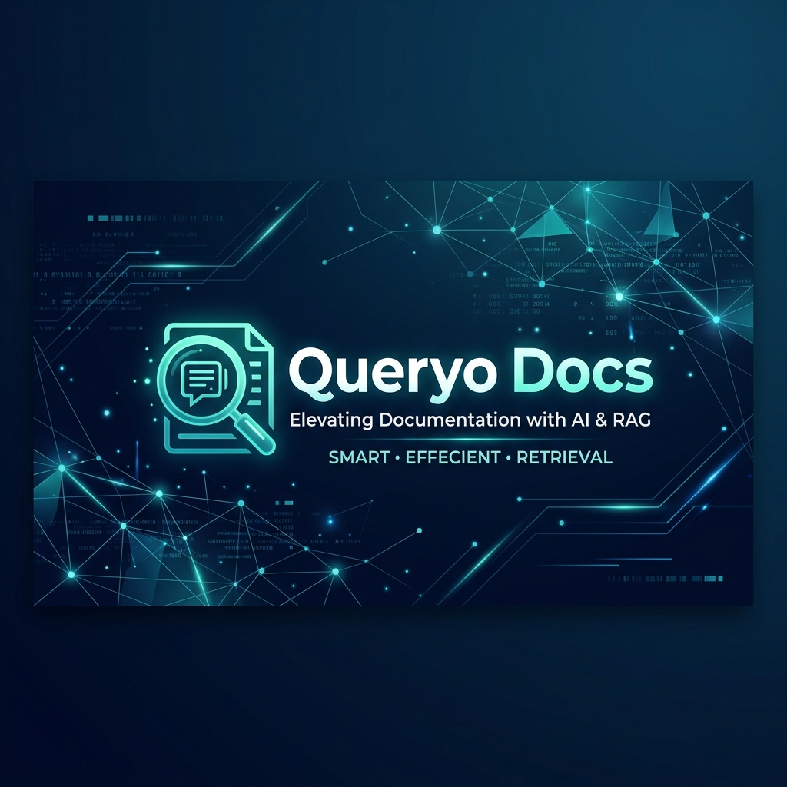
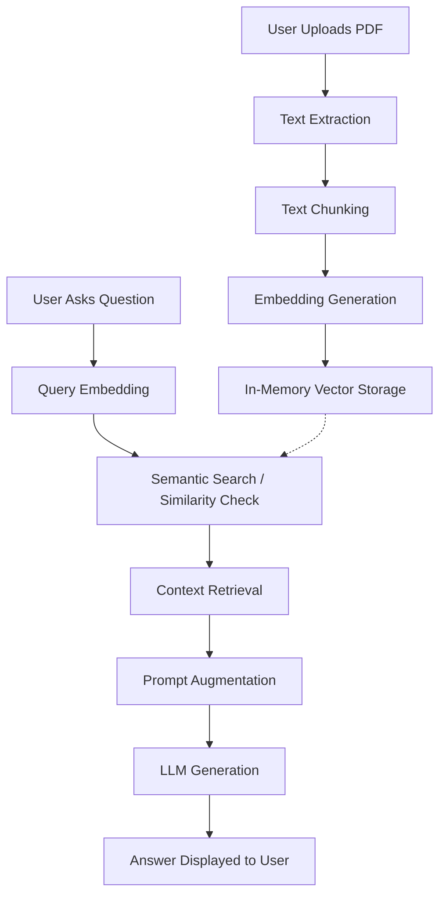

# 🔎 Queryo Docs  
### 📄 AI-Powered Document Question Answering System using Retrieval-Augmented Generation (RAG)

---

## 📌 Project Overview

**Queryo Docs** is an intelligent document-assistant that enables users to "chat" with their PDF documents. By leveraging the power of **Retrieval-Augmented Generation (RAG)**, it allows you to ask natural language questions about any uploaded PDF and receive precise, context-aware answers instantly.

Instead of scanning hundreds of pages manually, Queryo Docs finds the specific sections relevant to your query and uses an AI model to synthesize a clear response.

---

## 🧐 What is RAG? (The Magic Behind the App)

**Retrieval-Augmented Generation (RAG)** is a technique used to give LLMs (Large Language Models) access to specific, up-to-date information that wasn't in their original training data.

### 🧩 How it Works in Simple Terms:
1.  **Retrieval**: When you ask a question, the system searches through your document to find the most relevant paragraphs.
2.  **Augmentation**: These relevant paragraphs are then "attached" to your original question as background context.
3.  **Generation**: The AI model reads both your question AND the context to generate a factual, grounded answer.

This ensures the AI doesn't "hallucinate" (make things up) and instead bases its answers purely on the document you provided.

---

## 🧠 Key Technologies Explained

To make this happen, Queryo Docs uses several advanced AI concepts:

*   **Vector Embeddings**: These are mathematical representations of text. Think of them as "coordinates" in a space where similar meanings are close together.
*   **Semantic Search**: Unlike keyword search (which looks for exact words), semantic search looks for *meaning*. If you search for "pay," it might find "salary" because their embeddings are close together.
*   **Cosine Similarity**: A mathematical formula used to measure how similar two pieces of text are by looking at the angle between their vector embeddings.
*   **Large Language Model (LLM)**: We use **TinyLlama-1.1B**, a compact but powerful model that understands language and generates human-like responses.

---

## ✨ Features

- 📄 **PDF Support**: Upload any PDF document for instant analysis.
- 💬 **Interactive Chat**: Ask questions in natural language just like you're talking to a person.
- 🔍 **Deep Retrieval**: Performs semantic search to find the exact context needed.
- 🤖 **Local AI**: Designed to be lightweight, running efficiently on modern machines.
- 🖥 **Sleek UI**: A clean and minimal interface built with Streamlit for a premium user experience.
- 🔁 **Contextual Memory**: Remembers your previous questions for a smooth conversation flow.

---

## 🏗 System Architecture

The following diagram illustrates how your document flows through the system to become an answer:



---

## 🔄 The Technical Workflow

1.  **Text Extraction**: We use `PyPDF` to pull raw text from your PDF.
2.  **Chunking**: To maintain accuracy, we split long text into smaller, overlapping chunks (approx. 500 characters each).
3.  **Vectorization**: Each chunk is converted into a vector using the `all-MiniLM-L6-v2` model.
4.  **Retrieval**: When you ask a question, we find the top 5 most similar chunks using **Cosine Similarity**.
5.  **Generation**: The top 5 chunks + your question are sent to **TinyLlama** to produce the final answer.

---

## 🧰 Technology Stack

| Category | Technology Used | Description |
| :--- | :--- | :--- |
| **Language** | Python 3.x | The core programming language. |
| **Frontend** | Streamlit | Used for the interactive web interface. |
| **Embeddings** | SentenceTransformers | Specifically the `all-MiniLM-L6-v2` model for vectorizing text. |
| **LLM** | TinyLlama-1.1B-Chat | The "brain" that generates human-like responses. |
| **Math/Search** | Scikit-learn / NumPy | For calculating cosine similarity and managing vector data. |
| **PDF Handling** | PyPDF | For extracting text from PDF files. |
| **Chunking** | LangChain | For intelligently splitting text into manageable pieces. |

---

## ⚡ Installation & Setup

### 1. Clone the repository
```bash
git clone <repository-link>
cd <repository-name>
```

### 2. Create and Activate a Virtual Environment
**Windows:**
```bash
python -m venv venv
venv\Scripts\activate
```
**Linux / Mac:**
```bash
python -m venv venv
source venv/bin/activate
```

### 3. Install Required Dependencies
```bash
pip install -r requirements.txt
```

---

## ▶ Running the Application

Once the setup is complete, start the server using:
```bash
streamlit run app.py
```
The application will automatically open in your default web browser (usually at `http://localhost:8501`).

---

## 💡 Example Queries to Try

- "What is the main objective of this document?"
- "Can you list the key requirements mentioned?"
- "Summarize the conclusion in 3 bullet points."
- "What does the document say about the budget/stipend?"

---

## 🚀 Future Roadmap

- [ ] Support for **Multiple Documents** in a single session.
- [ ] Support for **Docx and Text files**.
- [ ] Integration with powerful external **Vector Databases** for large-scale storage.
- [ ] **Streaming Responses** for a faster "typing" effect.
- [ ] Support for higher-parameter models (like Llama-3 or Mistral).

---

## 📚 Conclusion

Queryo Docs demonstrates the power of combining traditional information retrieval with modern generative AI. It turns static documents into interactive knowledge bases, making information more accessible than ever before.

---

## 👨‍💻 Author

**Mohd Saif Ansari**  
B.Tech Computer Science  
Galgotias University